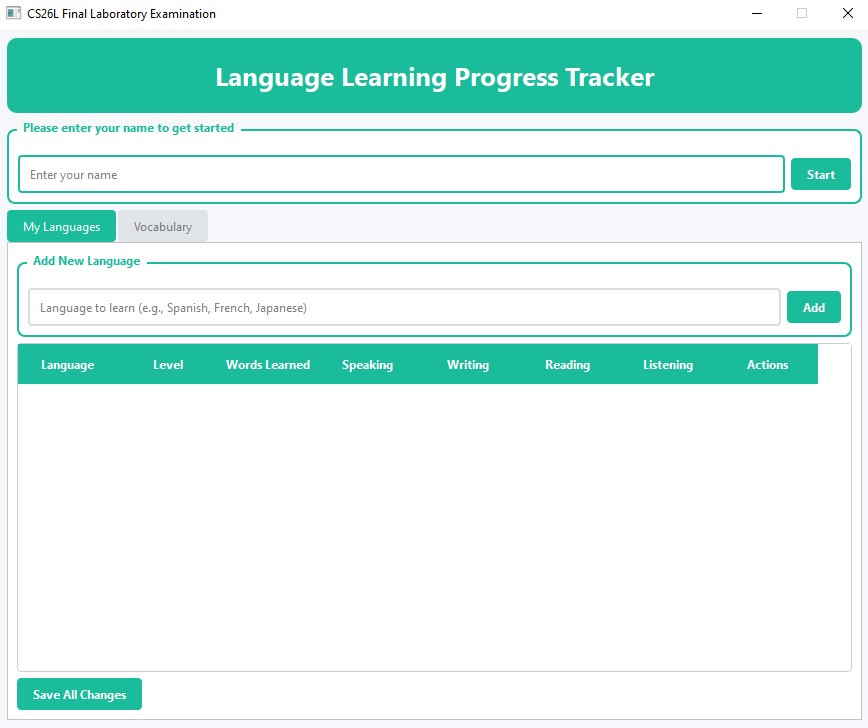
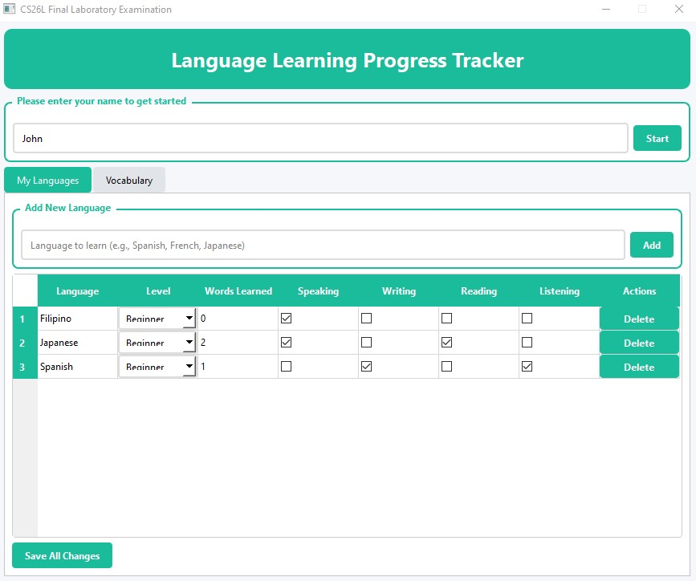
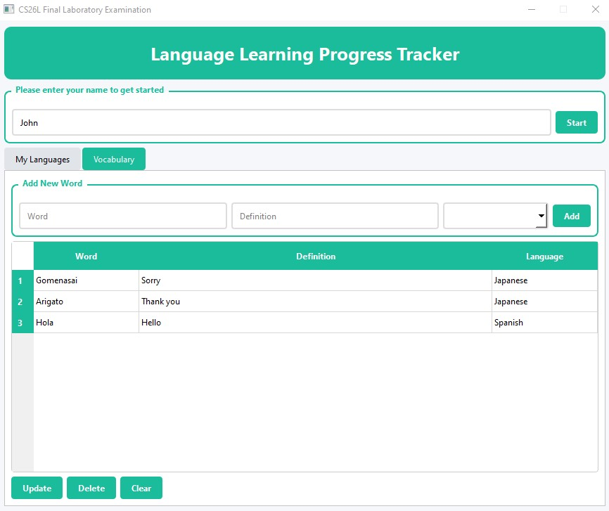

# Language Learning Tracker

---

**Proponent(s)**

Xander John Salarda - BSCS |  CS26L Final Laboratory Examination

---

**Project Overview**

The Language Learning Tracker is a desktop application that helps users monitor their progress in learning multiple languages. It allows users to track their vocabulary growth, language proficiency levels, and skill development across speaking, writing, reading, and listening. The application is designed for language enthusiasts, students, and polyglots who want to organize their learning journey. Built with Python and PyQt6, it features an intuitive GUI with SQLite database storage for persistent data management.

---

**Features**

- **User Profile Management**: Set up your profile once and manage multiple languages
- **Language Progress Tracking**: Add and track progress for multiple languages simultaneously
- **Vocabulary Management**: Add, update, and delete vocabulary words with definitions
- **Skill Development Monitoring**: Track speaking, writing, reading, and listening skills with checkboxes
- **Automatic Word Counting**: Words learned count automatically updates based on vocabulary entries
- **Level Progression**: Monitor language proficiency from Beginner to Advanced levels
- **Category Organization**: Organize vocabulary by language categories
- **Data Persistence**: All data is stored in SQLite database for long-term access

---

**Code Design and Structure**

The project follows Object-Oriented Programming principles with a modular architecture:

- **database.py** - Handles all database operations using SQLite, including user management and vocabulary CRUD operations
- **main_window.py** - Main application window that coordinates between different components and manages the user interface
- **user_tab.py** - Dedicated class for managing language progress and user profiles
- **vocab_tab.py** - Specialized class for vocabulary management functionality
- **main.py** - Application entry point that initializes the database and applies styling
- **style.qss** - External stylesheet for consistent and professional UI styling

The code is organized with clear separation of concerns:
- Database layer abstracted for easy maintenance
- UI components modularized for reusability
- Consistent naming conventions (PEP 8 compliant)
- Comprehensive comments and docstrings
- Error handling and user feedback throughout

---

### Screenshots

**Main Application Interface**


**Language Progress Tracking**


**Vocabulary Management**


---

### How to Run the Program

1. **Prerequisites**: Make sure Python 3.8+ is installed on your system

2. **Install Required Dependencies**:
   ```bash
   pip install PyQt6

3. **Download the Project**: Ensure all project files are in the same directory.

- main.py
- main_window.py
- user_tab.py
- vocab_tab.py
- database.py
- style.qss

4. **Run the Application:**
   ```bash
   python main.py
   
5. **First-Time Setup**:
Enter your name in the welcome screen

Click "Start" to begin

Add your first language in the "My Languages" tab

Start building your vocabulary in the "Vocabulary" tab

Note: The application will automatically create a user.db SQLite database file in the same directory to store your data.


